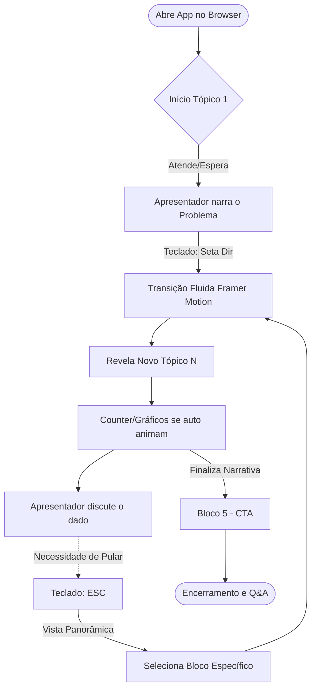

# UX Design Specification ApresentacaoAI

**Author:** Giuliano 
**Date:** 2026-03-04

---

<!-- UX design content will be appended sequentially through collaborative workflow steps -->

## Executive Summary

### Project Vision

ApresentacaoAI is an interactive web-based presentation designed to visually and narratively convey the evolution of AI-assisted software development—from the chaos of "Vibe Coding" to the discipline of "Context Engineering". Built as a React/Tailwind CSS application with an immersive, high-tech matrix aesthetic, it replaces static slide decks (like PowerPoint) with a dynamic, immersive experience. It serves dual purposes: a powerful visual aid for live corporate presentations and a permanent, interactive technical portfolio piece for the author.

### Target Users

1. **Tech Leads (Ricardo):** Experienced developers managing teams, looking for structured ways to adopt AI without losing code quality to "Context Rot". They need concrete metrics, real-world cases, and clear implementation paths (Spec-Kit → GSD → BMAD).
2. **Senior Developers (Fernanda):** Individual contributors looking to optimize their daily AI workflows and eliminate the frustration of AI "amnesia" during long generative sessions.
3. **Engineering Managers / CTOs (Marcos):** Decision-makers needing to see clear ROI, investment curves, and tangible efficiency gains before scaling AI tool licenses across the organization.
4. **Post-presentation Viewers:** Colleagues or recruiters exploring the interactive web app independently, requiring intuitive navigation and self-explanatory data visualization.

### Key Design Challenges

- **Narrative Pacing & Information Architecture:** Transforming 16 dense technical topics across 5 narrative blocks into digestible, engaging web interactions without overwhelming the user or breaking the storytelling flow.
- **Visual Legibility vs. Aesthetic:** Balancing the dark, neon-green "Matrix/high-tech" visual theme with absolute legibility required for both live projector viewing and individual monitor consumption.
- **Interactive Scalability:** Designing varied interaction patterns (animated counters, comparative tables, flip cards) that feel cohesive and enhance understanding rather than acting as mere gimmicks.

### Design Opportunities

- **"Form Equals Content":** Using modern web technologies (React animations, canvas effects) to present a topic *about* modern development paradigms, creating instantaneous credibility.
- **Data storytelling:** Transforming abstract metrics (like the 88% failure rate of unstructured AI or the 0%-70% context degradation) into visceral, animated visual components that create strong emotional "aha!" moments for the audience.
- **Keyboard-driven UX:** Crafting a seamless, presenter-focused navigation system that feels fluid and cinematic during a live talk.

## Core User Experience

### Defining Experience

A experiência central do **ApresentacaoAI** é uma **Jornada Narrativa Interativa**. O usuário (seja o apresentador ao vivo ou um visitante pós-palestra) navegará por 16 tópicos organizados em 5 blocos dramáticos: Problema, Evolução, Ferramentas, Novo Papel e Impacto. A principal ação do usuário é avançar por essa jornada visual de forma fluida, absorvendo dados complexos e métricas (como os 88% de falha do Vibe Coding e a escala Spec-Kit → GSD → BMAD) através de visualizações interativas e não apenas de leitura passiva de texto.

### Platform Strategy

- **Plataforma:** Aplicação Web (React + Tailwind CSS).
- **Dispositivos Target:** Otimizada primeiramente para Telas Grandes / Projetores corporativos (resolução de Desktop/TV), com responsividade garantida para tablets e monitores individuais.
- **Interação Base:** Fortemente controlada por Teclado (Setas, Espaço, Esc) para garantir que o apresentador não precise olhar para o mouse ou tela do laptop. O mouse/touch atua como fallback e para interações de exploração pontuais (hover em gráficos, flip cards).

### Effortless Interactions

- **Navegação Cinematográfica:** A transição entre os 16 tópicos deve acontecer de forma instantânea e roteirizada (usando framer-motion ou similar), sem tempos de carregamento, simulando uma experiência imersiva de app nativo.
- **Micro-interações de Dados:** Quando um novo tópico entra na tela, as métricas chave (ex: o counter de 0% a 70% no Context Rot) devem animar automaticamente de forma sutil, guiando os olhos da audiência sem que o apresentador precise apontar.
- **Modo Overview Rápido:** Pressionar "Esc" deve afastar a câmera/tela instantaneamente para mostrar todos os 16 tópicos e os 5 blocos, permitindo pular para uma seção específica sem fricção.

### Critical Success Moments

- **O "Hook" Visual (Tópico 1):** O momento em que a audiência percebe que não é um PowerPoint normal. A estética Matrix e a primeira métrica impactante (88%) aparecendo devem prender a atenção nos primeiros 30 segundos.
- **A Revelação do "Context Rot" (Tópico 3):** Quando a tabela de degradação anima, gerando o momento "aha!" de identificação imediata na audiência (tech leads e devs).
- **A Escala de Ferramentas (Tópicos 6 a 10):** A compreensão visual instantânea de que Spec-Kit, GSD e BMAD não competem entre si, ilustrada por uma UI que expande de soluções simples para sistemas multi-agentes.

### Experience Principles

1. **A Forma é a Mensagem:** A alta qualidade técnica e fluidez do app validam a autoridade do palestrante sobre o tema de engenharia de software avançada.
2. **"Show, Don't Tell" (Mostre, não conte):** Use componentes web (gráficos dinâmicos, snippets de código que se constroem sozinhos) para explicar conceitos em vez de bullet points.
3. **Foco no Apresentador Invisível:** A UX da UI deve permitir que o apresentador comande o ritmo no palco sem olhar para a máquina; o teclado dita tudo.
4. **Legibilidade Inflexível:** Apesar do apelo estético "filme de hacker" (Matrix neon), o contraste de tipografia deve ser perfeitamente legível até na última fileira de uma sala de conferência com projetor ruim.

## Desired Emotional Response

### Primary Emotional Goals

1. **Autoridade & Curiosidade (Hook inicial):** A imersão técnica imediata (estética de terminal/Matrix) transmite que "este palestrante sabe do que está falando". O público deve sentir curiosidade e respeito intelectual logo no Tópico 1.
2. **"Catharsis" / Identificação (O Problema):** Ao ver os dados sobre Context Rot e as analogias (ex: IA com Alzheimer), a audiência técnica deve sentir um "Aha!" e alívio — o sentimento de "eu não sou o único sofrendo com o Vibe Coding".
3. **Empoderamento (A Solução):** Quando apresentadas as ferramentas (Spec-Kit → GSD → BMAD), a frustração inicial deve dar lugar à clareza e empoderamento ("isso é metodológico, não mágico, e eu consigo aplicar").

### Emotional Journey Mapping

- **Ao descobrir (Tópicos 1-3):** Choque de realidade e validação de dores diárias. Sensação de urgência diante das métricas de falha (88%).
- **Durante a experiência central (Tópicos 4-10):** Clareza progressiva. A passagem da tensão para a inspiração ao entender como as ferramentas escalam.
- **Após completar a jornada (Tópicos 14-16 - CTA):** Motivação para a ação. O paradoxo do júnior e o ROI devem gerar um senso de inevitabilidade ("preciso começar a testar specs amanhã").

### Micro-Emotions

- **Confiança vs. Ceticismo:** O ceticismo natural de engenheiros sobre "hype de IA" é combatido por métricas duras e cases reais de mercado, construindo confiança sólida na mensagem.
- **Admiração vs. Tédio:** Onde uma apresentação normal entediaria, a estética e as animações a 60fps causam admiração pela execução (“form equals content”).

### Design Implications

- **Autoridade e Foco (Estética):** O uso de fundo escuro com toques de verde neon força a atenção. Sem distrações. A interface "desaparece" para destacar a informação.
- **Catarse Visual (Animações de Dados):** O contador de degradação do contexto ou o gráfico de "Escada Quebrada" não são apenas informativos; a animação de um dado trágico gera a emoção desejada no momento certo.
- **Confiança (Transições Fluidas):** Bugs ou jank visual quebrariam a ilusão de competência. A navegação governada por teclado sem falhas garante uma percepção de alta confiabilidade.

### Emotional Design Principles

1. **A Forma Valida o Fundo:** O meio de entrega (uma app web impecável) é tão persuasivo quanto o argumento falado.
2. **Tensão e Resolução:** Use o design para acentuar o arco dramático — visualmente mais denso/caótico no bloco do "Vibe Coding", mais estruturado e limpo nos blocos de BMAD e Spec-Kit.
3. **Respeito pelo Desgastado:** Muitos devs estão cansados da fadiga de ferramentas; o design não deve vender "mágica", mas sim engenharia e pragmatismo.

## UX Pattern Analysis & Inspiration

### Inspiring Products Analysis

A referência principal para o ApresentacaoAI não são ferramentas estáticas como PowerPoint ou Google Slides, mas experiências web imersivas de classe mundial focadas em público técnico:

- **Estilo Matrix/Terminal (Referência Principal do Projeto):** Como definido no Tópico 1 ("animação estilo terminal digitando com caracteres verdes fluindo") e no Tópico 5 ("partículas de código caindo de specs"). Isso estabelece o tom técnico, evocando precisão, hacking cultural e o ecossistema "developer-first".
- **Stripe & Vercel Landing Pages:** O uso constante de dados vivos e interações sob demanda das melhores empresas "DevTools" (como o split-screen animado do Tópico 5 comparando as 12 horas tradicionais versus 15 min de SDD).
- **Gamified Interactive Data:** O Wizard estruturado no Tópico 10, que se assemelha a uma interface de linha de comando guiada em sequência (A/B/C) para tomada de decisão técnica.

### Transferable UX Patterns

Padrões de navegação e componentes que já foram aprovados nos Tópicos e fundamentam a aplicação completa:

**Navigation Patterns:**
- **Cinematic Paging (Teclado):** Navegação unicamente baseada nos fluxos narrativos de avanço `[←]` / `[→]` sem carregamento de páginas.
- **Top/Down Bird's Eye View:** Tecla "Esc" ou gesto para "afastar a câmera" mostrando todos os blocos (Problema, Evolução, Ferramentas) — mapeamento já previsto na estrutura macro (Tópicos 1 ao 16).

**Interaction Patterns:**
- **Counters Animados:** Empregados para dados de impacto, como o counter de 0 até 88% no Título 1 (fundo vermelho/alarme) ou os 26.08% e 55% de ganho apresentados no Tópico 5.
- **Split Screens Comparativos:** Usados para contrastar o Vibe Coding (Caos, Esq, Vermelho) vs. Spec-Driven (Estruturado, Dir, Verde) no Tópico 5.
- **Wizards Modais Direcionais:** Terminais "passo a passo" baseados no tópico 10 para conduzir o Tech Lead a sua recomendação entre (Spec-Kit vs. GSD vs. BMAD).

**Visual Patterns:**
- **Tabelas / Matrizes Animadas:** "Tabela Viva", especificada no Tópico 10, com hover/scanline para dar o feeling visual high-tech em células densamente informativas (ex. "quando usar em 1 frase").
- **Card Flips / Highlight Glows:** Highlight nos rodapés para focar na "adoção/tração" e diagramas que reagem a over/focus de mouse para destrinchar blueprints (Tópico 5).

### Anti-Patterns to Avoid

- **Walls of Text (Bullet Points sem vida):** Em vez de listar os princípios do Context Rot, deve haver componentes visuais — texto engessa; blocos animados engajam.
- **Mouse-First Presentation:** Impor uso do cursor para avançar a apresentação, minando a autoridade de quem apresenta em um palco ("Presenter-Invisible" é crítico).
- **Disputa por Atenção (Visuais muito pesados ou distrações):** Efeitos de chuva matrix exagerados que possam atrapalhar a legibilidade extrema na sala de conferência corporativa. A legibilidade inflexível e limpa da informação tem sempre prioridade sobre as alegorias do visual.

### Design Inspiration Strategy

**What to Adopt (Para ser adotado rigorosamente conforme os Tópicos):**
- Layout baseado em **Split-Screen** para analogias de "antes/depois", e **Terminais Guiados** para seções operacionais como wizards e fluxos.
- Paleta dicotômica forte: "Vermelho/Glow de Alerta" (para Vibe Coding/Problemas) e "Matrix Green/Glow" (para Spec-Driven/Soluções), ditado pelas referências de cor já estabelecidas.

**What to Avoid (O que deixamos de lado):**
- Ferramentas genéricas de scroll vertical, sliders web desestruturados, ou transições demoradas que quebrem os "60fps" previstos na fundação do seu Product Brief.

## Design System Foundation

### 1.1 Design System Choice

A fundação visual não utilizará uma biblioteca de componentes engessada (como Material UI ou Bootstrap). A escolha definida é um modelo "Utility-First" construído nativamente com **Tailwind CSS** sobre **React**, acompanhado de **Framer Motion** (ou biblioteca similar) para orquestrar as transições cinematográficas e animações baseadas no teclado.

### Rationale for Selection

- **Liberdade Visual Absoluta:** O tema "Matrix / High-Tech" exige controles granulares de sombras (glows neon), cores extremas (preto profundo e verde brilhante) e tipografias específicas ("hacker/terminal") que costumam conflitar com bibliotecas de componentes tradicionais. 
- **Performance de Renderização (60fps):** Como as transições precisam ser fluidas e instantâneas (cinematográficas), o Tailwind CSS garante um bundle CSS minúsculo e focado apenas no que é usado, enquanto Framer Motion lida com o GPU sem causar *jank* (engasgos nas animações).
- **Sem bagagem indesejada:** O projeto não precisa de dezenas de inputs de formulários, seletores de data, ou componentes de e-commerce que vêm acoplados num sistema corporativo padronizado. Precisamos de *Cards, Tipografia, Contadores e Layouts modulares*.

### Implementation Approach

- Construção de **Componentes Wrapper customizados** em React (ex: `<NeonCard>`, `<MatrixTerminal>`, `<AnimatedCounter>`, `<SplitScreen>`).
- Utilização de classes utilitárias isoladas para compor o visual.
- Event Listeners globais no nível raiz da aplicação em React para interceptar atalhos de teclado (Setas, Espaço, Esc) de forma nativa e acionar eventos que refletem nos componentes.

### Customization Strategy

- **Tokens Base (Tailwind Config):**
  - **Colors:** Extensão agressiva das paletas com `Matrix Green` (ex: `#00FF41`), e `Alert Red` (`#FF003C`) para os contrastes do modo Vibe Coding. Fundo principal baseado em Preto Absoluto (`#000000`) ou Cinza Espacial (`#0A0A0A`).
  - **Typography:** Configuração de fontes monoespaçadas (ex: Fira Code, JetBrains Mono para códigos/métricas) e uma fonte sem serifa limpa (ex: Inter ou Roboto) para legibilidade em longos trechos de texto corporativo.
  - **Effects:** Setup de utilitários personalizados para "glow" text-shadow e manipulação do canvas background simulando a chuva digital.

## 2. Core User Experience

### 2.1 Defining Experience

**"Navegação Cinematográfica Guiada por Storytelling Tecnológico"**.
A experiência central de *ApresentacaoAI* é a de ser conduzido através de cenários visuais, onde a transição de um tópico denso para outro acontece de forma cinematográfica, sem interrupção (sem a "tela preta" ou slide de Loading). A core action ("Pressionar a seta para o próximo tópico") não deve apenas trocar o texto na tela, mas iniciar uma coreografia de componentes de interface que revelam informação. Essa interação principal é o que difere a aplicação de um simples deck de slides.

### 2.2 User Mental Model

**Modelo Tradicional:** O espectador de palestras espera a estrutura clássica — um slide entra, substitui tudo, contém um título, 3 bullet points, o apresentador lê ou aponta para eles e depois passa para o próximo.
**O Paradigma Novo (Mental Model desta Aplicação):** A apresentação funciona como a interface de um software rodando ao vivo. Não tem slides fechados; tem **estados**. O usuário entende que as partes da tela reagem sozinhas (como os counters e os toggles visuais) ao mesmo tempo em que a narrativa verbal desenrola. Eles devem ter o sentimento de observarem um painel executivo ou terminal vivo que está ilustrando o que está sendo dito.

### 2.3 Success Criteria

- **Zero "Jank" Sensorial:** Transições sempre suaves (mirando 60fps). Um *stuttering* na renderização do próximo tópico causa perda imediata de autoridade ("Como ele propõe processos avançados se nem a página roda fluido?").
- **Coreografia de Dados:** Os dados-chave (como 88% no Tópico 1 ou +55% de velocidade no Tópico 5) só revelam sua animação ao final da transição da entrada desse componente, cimentando o ponto verbal do apresentador.
- **Presenter Confidence:** O apresentador sente absoluta confiança e previsibilidade sabendo exatamente como a tela reagirá ao clique da tecla `[→]`, desnecessitando olhar para a tela para confirmar "qual slide estou".

### 2.4 Novel UX Patterns

Mesclar **"Deck de Palestra" com "Dashboard Dinâmico"**. 
Enquanto a ação de "navegar lateralmente" é super estabelecida (todos sabem o que a seta da direita faz), a novidade está no **resultado** disso: em vez de carregar a tela, a UI anima componentes inteiros de layout (como o Wizard do Título 10, o split screen de comparação). A experiência utiliza a metáfora de uma *IDE (Integrated Development Environment)* no visual, trazendo algo extremamente familiar aos desenvolvedores, porém utilizado subversivamente como um canvas de Storytelling.

### 2.5 Experience Mechanics

**1. Initiation (Invocando a narrativa):**
- O apresentador, enquanto finaliza o pensamento falado do bloco atual, bate no teclado (`[Seta para a direita]`, `Spacebar` ou Enter).

**2. Interaction & Transition (A mecânica):**
- O framework de roteamento/estado global da aplicação atualiza a flag do tópico ativo (ex: de `topic-4` para `topic-5`).
- A aplicação utiliza `AnimatePresence` (do framer motion) para deslizar o elemento visual anterior e efervescer a matriz do recém acionado.
- Nenhuma das ações requerem cursor do mouse; elas são todas orquestradas pelo `Keyboard EventListener`.

**3. Feedback:**
- A barra de progresso universal no rodapé avança imperceptivelmente (mostrando blocos 1 até 5).
- A cor de "perigo" (Vermelho, no início) transiciona visualmente para um tom de "sucesso e estrutura" (Verde, ao longo do arco evolutivo).

**4. Completion:**
- A nova tela estabiliza sua posição, animações de dados disparam, o foco de atenção da audiência foca perfeitamente no novo ponto nodal da narrativa.

## Visual Design Foundation

### Color System

A paleta é ditada inteiramente pela temática "Tecnologia / Terminal Matrix", com contrastes altíssimos projetados para legibilidade forçada e uma distinção dicotômica clara entre o "Problema" e a "Solução".

- **Background Principal:** Absolute Black (`#000000`) ou Deep Matte Charcoal (`#0A0A0A`) para criar a imersão completa e economizar luz em telas/projetores.
- **Primary Accent (Soluções, SDD, BMAD):** Matrix Neon Green (`#00FF41`). Usada para destaques absolutos, tipografias de botões ativos, glows em cards selecionados. Traz a conotação de aprovação cibernética.
- **Secondary Accent (Problemas, Vibe Coding, Erros):** Cyber Red / Alert Action (`#FF003C`). Utilizada nas primeiras etapas do arco narrativo para destacar métricas de falha (ex: 88% de CTOs com problemas) e tabelas de degradação.
- **Support / Text Colors:**
  - *Main Text:* Ghost White (`#F3F4F6`) para legibilidade limpa contra o fundo preto.
  - *Muted Text:* Slate Gray (`#9CA3AF`) para metadados, fontes menores, bordas passivas.

### Typography System

Dois papéis fundamentais de tipografias são necessários. A tipografia precisa ser séria o suficiente para um ambiente corporativo (Tech Leads e CTOs assistindo) mas evocar a origem dev.

- **Primary Typeface (Monospace para Dados e "Tech Vibe"):** *JetBrains Mono*, *Fira Code* ou similar. Será usada em títulos de tópicos (`h1`, `h2`), números de dashboards (ex: `88%`, `+55%`) e dentro dos componentes tipo terminal. Ela transmite engenharia de software e "código" imediatamente.
- **Secondary Typeface (Sans-Serif para Conteúdo de Leitura):** *Inter* ou *Geist* (com as variantes suportadas). Como haverão parágrafos breves explicando métricas ou cases de uso, precisamos do extremo conforto visual que a fonte sem serifa proporciona, evitando cansar os olhos da audiência focada num fundo preto.

### Spacing & Layout Foundation

- **Spacing Base (Tailwind default rems):** O padrão escalonado de 4px de Tailwind (`p-4`, `p-8`...) guia os componentes.
- **Layout System:** Sem paginações estressantes visuais. Será utilizado um design estruturado no grid *CSS Flexbox/CSS Grid*. Principalmente `min-h-screen` englobando flex layouts centrados `flex items-center justify-center` por padrão, onde o conteúdo de um tópico inteiro habita quase exclusivamente no centro vertical da visão do usuário (permitindo folgas no topo/rodapé para não sofrer cortes visuais em projetores).
- **Densidade:** Ao contrário de dashboards densos, uma apresentação demanda espaço de respiro gigante (*Airy/Spacious*). Margens amplas entre o título da seção, métrica principal e o texto auxiliar para forçar o foco de atenção em apenas uma coisa de cada vez.

### Accessibility Considerations

- **Contraste Rígido:** Elementos em verde neon/vermelho sobre fundo preto atingem contrastes altos nativamente, ideais para acessibilidade visual WCAG (AA/AAA).
- **Redução de Motion Sickness:** Embora utilizemos transições (Framer Motion), não haverá rotações de eixo excêntricas 3D de tela toda. Tudo usará fades ou pequenos movimentos de eixo X (`animate={{ x: 0, opacity: 1 }}`). Para quem utiliza *prefers-reduced-motion* nos sistemas operacionais, o Framer Motion terá fallback simples de opacity crossfade sem deslocamento de eixo.

## Design Direction Decision

### Design Directions Explored

Dado o escopo restrito de uma "Apresentação Interativa e Imersiva" com tema hacker estabelecido, as explorações focaram em como equilibrar a estética (o tema Matrix) com a funcionalidade (legibilidade e ritmo de apresentação corporativa). O caminho ignorou propositalmente alternativas baseadas em Light Mode ou dashboards densos em prol de focar puramente em "Storytelling Component-Based". 

### Chosen Direction

**A Direção Consolidada: "Cinematic Tech-Terminal"**

Essa direção trata cada tópico (1 ao 16) não como uma página vertical, mas como uma "Lente de Câmera" imersiva e estática que não rola.
- **Micro-Layouts Modulares:** O posicionamento na tela irá variar dependendo do Tópico. Alguns tópicos (como o Tópico 1) usarão *Split-Screen* (Analogia de um lado, Métricas do outro). Outros (como o Tópico 10) usarão *Card Flow Centralizado* (Wizard passo a passo cobrindo a tela toda). Ou seja, o layout muta para servir ao conteúdo específico, não há um "template único de texto à esquerda" padrão do PowerPoint.
- **Visual Weight:** Foco agressivo em Tipografia Gigante, Counters Animados e Componentes Escuros com bordas/linhas Neon (Verde ou Vermelho) que ganham brilho com interação.

### Design Rationale

1. O apresentador (Tech Lead/CTO) precisa que os dados saltem aos olhos imediatamente para sustentar a narrativa verbal. Layouts engessados limitam a força de gráficos dinâmicos.
2. A variação de layouts entre um tópico e outro (ex: sair de um slide de "Texto Simples" direto para um "Split Screen") força a mente humana da audiência a reengajar repetidas vezes, quebrando o chamado *slide-fatigue*.

### Implementation Approach

A aplicação será um *SPA (Single Page Application)* robusto.
- Teremos um componente estrutural `AppShell` ou `PresentationLayout` que contém a lousa de fundo digital (Canvas/Matrix-Rain) fixa.
- Dentro dela, o roteamento injetará dinamicamente as Views/Componentes específicas de cada `Tópico`.
- O framework base de animação injeta comportamentos de transição para "Deslizar para Esquerda/Direita" conectando narrativamente o avanço da história.
- Uma barra de progresso universal e sutil fixa na parte inferior amarra a jornada.

## User Journey Flows

### Journey 1: The Guided Presentation (Presenter Mode)

Esta é a jornada principal, onde um apresentador navega pelos tópicos frente a uma audiência. O fluxo deve eliminar a necessidade do apresentador olhar para a tela para saber o que acontecerá, tornando a experiência fluida e teatral.

- **Efficiency & Delight:** As animações de dados auto-iniciadas são a parte do "delight"; retiram a necessidade do click mouse-over.

### Journey 2: The Self-Hosted Portfolio Explorer (Visitor Mode)

A jornada secundária representa o usuário que recebe o link após a palestra. Para ele, ler 16 tópicos inteiros como "slides" pode ser maçante. Ele precisa poder explorar as soluções interativamente.

```mermaid
graph TD
    Start([Acessa Link Deploy]) --> Landing[Visualiza Tópico 1/Hook]
    Landing --> Action{Ação do Visitante}
    
    Action -->|Teclado Seta Dir| Linear[Segue Roteiro Linear]
    Action -->|Mouse/Touch Scroll| Touch[Animações rolam baseadas no Scroll]
    Action -->|Clica no Menu Inferior| Jump[Pula para Seçäo Específica]
    
    Jump --> ToolX[Ex: Seleciona Bloco 3: Ferramentas]
    Touch --> Linear
    ToolX --> ComponentInteract[Interage com Card Flip ou Wizard]
    ComponentInteract --> Value[Ganha entendimento modular]
    
    Value --> CTA[Tópico 16 - Ação GitHub/Ferramentas]
```

- **Efficiency & Delight:** Fornecer suporte a cliques para quem acessa usando o mouse no laptop em vez do teclado. Os mini-blocks como a "Tabela Viva" e o "Wizard" mantêm a atenção no visitante solitário.

### Journey Patterns

- **Sequential Unveiling:** Nunca sobrecarregue o usuário com dados todos de vez; o slide carrega o background, depois o título, depois a métrica, em micro-intervalos orquestrados.
- **Escape Hatch (Modo Overview):** Para não frustrar navegações quebradas, a visão panorâmica ativável via teclado/menu sempre permite voltar ao norte.

### Flow Optimization Principles

- **Keyboard-First, Mouse-Allowed:** Para a Journey 1, foco 100% no teclado (Arrows, Space, Escape, Enter). Para a Journey 2, todas essas ações devem ter equivalente em hit-boxes grandes de click, pensadas para o conforto do explorador web.

## Component Strategy

### Design System Components (O que Tailwind nos dá nativamente)

- **Tipografia Escalonada:** Classes de tamanho, peso e alinhamento (ex: `text-6xl`, `font-mono`).
- **Contêineres de Layout e Grid:** Flexbox para alinhamentos multi-direcionais (ex: tela dividida meio-a-meio).
- **Core Shapes, Borders e Sombras Base:** Bordas coloridas. No entanto, precisaremos fazer composições customizadas para chegar no "Neon" e "Interface de Terminal Humano" idealizada nas Steps 08/09.

### Custom Components (Principais)

Não usaremos bibliotecas prontas de UI que vêm cheias de modais ou inputs complexos. Construiremos "Macro-Componentes de Storytelling" específicos.

### `1. <TopicCanvas>`

**Purpose:** O Wrapper mestre de cada Tópico (1 ao 16) consumindo o espaço principal da tela e orquestrando as animações de entrada das suas *child props*.
**Usage:** Reutilizado 16 vezes. Ele gerencia o seu "mount" via Framer Motion, impedindo o layout de quebrar ao deslizar.

### `2. <AnimatedCounter>`

**Purpose:** Componente focado em gerar emoção pura através de números em aceleração contínua, usado majoritariamente para métricas de dor ou adoção.
**Usage:** Destacar o `88%` do Tópico 1 ou os `26.08%` e `55%` do Tópico 5.
**Interaction Behavior:** Se anima ("conta do zero ao valor") apenas quando entra no Viewport ou no foco narrativo.
**Variants:** Cor `danger` (Red) ou `success` (Matrix Green). Tamanho macro para ocupar a direita da tela ou mini para tabelas.

### `3. <SplitScreen>`

**Purpose:** Layout estrutural que divide visualmente a tela em um "Antes/Problema" vs "Depois/Solução" (ex: Vibe Coding vs Spec-Driven) conforme o Tópico 5.
**Anatomy:** Esquerda recebe Flex 1 com fundo contendo um Noise/Caos sutil e Cor Danger. Direita recebe Flex 1 estruturado, geométrico e Matrix Green.

### `4. <LiveTable>` (Tabela Viva do Tópico 10)

**Purpose:** Comparar Spec-Kit vs GSD vs BMAD em dimensões interativas.
**Usage:** Estrutura em Grid modular. Células possuem efeito scanline (Matrix) em *hover*, com Tooltips explicando instâncias rápidas como "O que é um PRD?".

### `5. <DecisionWizard>` (Micro-Fluxo do Tópico 10)

**Purpose:** O "terminal" que engaja o visitante pós-palestra simulada para chegar na ferramenta ideal.
**Interaction Behavior:** Composto por pequenas divs perguntas clicáveis, alterando um estado interno para guiar linearmente até uma Resposta (A recomendação de Spec-Kit/GSD/BMAD + Tradeoffs).

### `6. <CyberProgressBar>`

**Purpose:** Ancora a jornada global de apresentação no rodapé, dando norte visual de "onde estamos".
**Anatomy:** Linha horizontal segmentada em 5 blocos. Acende (Glow Effect verde) baseada na propriedade `activeTopic`.

### Component Implementation Strategy

1. **Framework Atômico:** Serão construídos na pasta `components/ui/` do app React. Todos recebem `motion` do Framer Motion na raiz e classes estilizadas via Tailwind.
2. **Componentes sem Estado e Controlados pela Narrativa:** Componentes como `AnimatedCounter` não decidem quando rodar; o `<TopicCanvas>` dita a ordem de orquestração de animação usando Variants do Framer Motion.

### Implementation Roadmap

**Phase 1 - Estruturas Nucleares (Shell/Routing):**
- Layout Base e chuva de fundo (Efeito genérico Canvas opcional).
- `<TopicCanvas>` e `<CyberProgressBar>`.
- Hook de Teclado global (`usePresentationNavigation`).

**Phase 2 - Componentes Narrativos Padrão:**
- `<SplitScreen>`, Card de Texto Básico.
- `<AnimatedCounter>` (Sendo o principal driver de emoções de dados).

**Phase 3 - Componentes Avançados e Customizados (Bloco 3):**
- `<LiveTable>`.
- `<DecisionWizard>`.

## UX Consistency Patterns

### Event-Driven Animations (Padrão Principal)

**When to Use:** Sempre que um Tópico contiver métricas vitais ou diagramas complexos que precisem "contar uma história".
**Behavior:** Componentes quantitativos (Counters, Barras de Progresso, Linhas conectando nós em um diagrama) devem utilizar um `Delay` de start de no mínimo `0.4s` após a renderização da tela. Isso garante que o apresentador termine a transição narrativa verbal ("...e isso nos leva ao problema principal:"), e a tela assuma seu papel visual logo a seguir. Não deixe animações colidirem com os instantes iniciais da transição de tela.

### Navigation Affordances (Click/Key Consistency)

**When to Use:** Em todos os componentes que geram avanço narrativo ou drill-down (Células do Card, Respostas do Wizard).
**Visual Design:** Sinais táteis virtuais rigorosos. Componentes que suportam clique ou enter devem ter um sutil efeito de "glow" esverdeado na borda que expande em estado de `:hover` ou `:focus`, para que os usuários pós-palestra não tenham dúvidas de que a porção da tela é viva.
**Behavior:** Todas ações de teclado (Space/Arrow Right) no Modo Apresentador devem mapear para o "Avanço Seguro" padrão, enquanto componentes engajáveis na própria tela devem capturar foco (`tabindex`) adequadamente.

### The "Matrix Flow" (Data Streaming Style)

**When to Use:** Em simulações de código ou leitura de logs que ocorrem em analogias ao longo da apresentação (como os comandos do GSD no tópico 8).
**Visual Design:** Fonte monoespaçada verde com efeito de terminal.
**Behavior:** Em vez de fazer a tela carregar mostrando 20 parágrafos de texto, o texto é gerado via *typewriter effect* (Efeito de Máquina de Escrever), caractere por caractere (rápido, simulando output de LLM). Ajuda a ilustrar a natureza procedural da IA e mantém os olhos da audiência fisgados na tela letreirando o texto.

### Comparative Split (The Dichotomy Rule)

**When to Use:** Em Tópicos como o Tópico 5, onde demonstramos Vibe Coding vs. Spec-Driven, ou Tópicos que exibem os custos vs. economia.
**Behavior:** O padrão manda que o "Problema" seja sempre justificado espacialmente à Esquerda e/ou Acima, e tingido de tons de Vermelho/Alaranjado. A "Solução" sempre deve ocupar o Topo, Lado Direito e ser envolto por verde. Essa linguagem espacial cria um modelo mental quase invisível no cérebro do participante; sempre que o verde preencher a direita da tela, ele sabe que estamos num platô de resolução. 

## Responsive Design & Accessibility

### Responsive Strategy

Essa não é uma aplicação "Mobile-First". O design será estruturado como **"Desktop/Projector-first"**. 
- **Telas Grandes (Projetores / TVs / Monitores Desktop):** O layout brilha e consome espaçamentos confortáveis (`gap-8` a `gap-16`) para o público não forçar a vista. Fontes gigantes (ex: Títulos em 6xl, Dados numéricos em 8xl/9xl).
- **Tablet (Consultoria Interna):** Telas `Split-Screen` (Tópico 5) manterão seu estado dividido até a resolução de Tablet Landscape.
- **Mobile (Fallback Exploratório):** Dispositivos menores farão o empilhamento vertical do conteúdo (Colapso CSS Grid / Flex-col). No celular, não haverá "Apresentação Teatral", mas sim uma experiência simples onde se dá "Scroll para baixo" consumindo a narrativa como um longo artigo interativo.

### Breakpoint Strategy

Utilizando a fundação de Breakpoints padrão do Tailwind CSS combinada ao objetivo do projeto:
- `default (mobile)`: Layout verticalizado e em "scroll puro", focando na leitura unitária.
- `md (768px)`: Entrada do formato Desktop simulado, ativação de blocos dinâmicos complexos (ex: ativação do Wizard no Tópico 10 e Tabela Viva).
- `lg (1024px)` e `xl (1280px)`: Breakpoints mestres onde o conteúdo adquire o espaçamento necessário para não encostar nas bordas de TVs antigas ou projetores corporativos esticados. Títulos e Counter Data alcançam seu tamanho pretendido (H1 colossal).

### Accessibility Strategy

**WCAG Level AA Requirement**
Dadas as particularidades ambientais de uma sala de palestra (possivelmente mal iluminada e com projetores baratos), a acessibilidade neste projeto foca quase exclusivamente no rigor mecânico da visualização e teclado.

- **Contraste Rígido Obrigatório:** Fundo `#000000` ou `#0A0A0A` contra Branco `#FFFFFF` (para textos comuns) e Neon Green `#00FF41` para títulos, alcança ratings perfeitamente dentro dos limites da WCAG para "Leitura em Grandes Telas".
- **Keyboard Trapping/Tabbing:** Considerando o `Presenter Mode`, a UI global capturará qualquer evento de `keydown` nas setas direcionais. Porém, no modo visitante, botões interativos devem suportar estado `:focus-visible` com um halo de destaque nítido, validando a progressão no Wizard do Tópico 10 sem toque.
- **Transições Inteligentes (Reduced Motion):** Como citado em Etapas anteriores, suporte global no Framer Motion para reverter fades espaciais para fades estáticos baseando-se por meio do *prefers-reduced-motion*.

### Testing Strategy

1. **Testes de Campo em Baixa Definição:** Abrir o local host em Chrome, reduzi-lo ao modo fullscreen de 1024x768 (ou simular projeção corporativa inferior) para assegurar que elementos vitais de interface não estão caindo para fora do *Fold* (O "corte" principal da visão da tela).
2. **Keyboard QA Completa:** Navegar pelo app da tela 1 a 16 utilizando as mãos sem o mouse. Conseguir operar 100% da navegação através do loop e interações (Tópico 10) sem fricções.
3. **Audit via Lighthouse:** Garantir e registrar pontuação superior a `90` requisitada no *Product Briefing* assegurando que pacotes Framer Motion/Tailwind estejam performando velozmente.

### Implementation Guidelines

- Empregue *Viewport Height e Width (`vh`/`vw`)* para garantir que os componentes primários assumam o controle da tela baseado onde a resolução bate. 
- Evite fixar alturas com Pixels (`h-[500px]`), porque telas de conferência mudam arbitrariamente, limitando a performance da página.